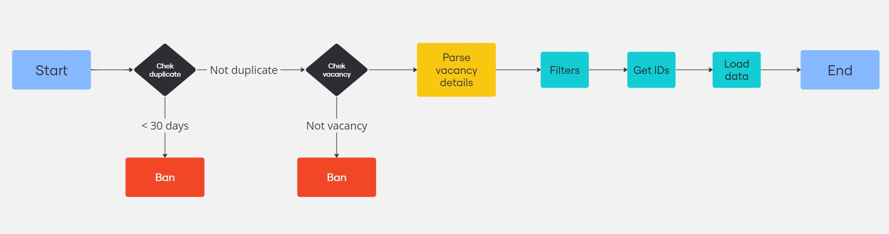

# Бот для сбора данных о вакансиях в Telegram

### Описание
Бот, написанный на Python, предназначен для мониторинга Telegram-каналов с вакансиями, обработки собранных данных и их сохранения в базе данных для дальнейшего анализа.

### Функции

1. **Мониторинг Telegram-каналов**
   - Отслеживает новые сообщения в нескольких Telegram-каналах (например, `UstozShogird`, `uzdev_jobs`, `itjobstashkent` и др.).

2. **Фильтрация данных**
   - Определяет и пропускает дублирующиеся сообщения на основе уникальных параметров (источник, дата, текст).
   - Фильтрует сообщения, чтобы оставить только те, которые соответствуют критериям вакансий.

3. **Обработка данных**
   - Очищает и стандартизирует текст сообщений.
   - Извлекает информацию о вакансии: должность, компания, местоположение, зарплата и другие детали.
   - Конвертирует зарплаты в доллары США.
   - Классифицирует вакансии по категориям (например, языки программирования, используемый стек технологий).

4. **Интеграция с базой данных**
   - Сохраняет основные данные о вакансиях: местоположение, компания, опыт, источник, зарплата и дата.
   - Хранит исходный текст сообщений из Telegram, включая ID сообщения.
   - Записывает связанные языки программирования и технологии.

5. **Логирование**
   - Ведёт журнал операций, включая обработку сообщений, фильтрацию, запись в базу данных и ошибки, что обеспечивает прозрачность работы и упрощает отладку.

### Технологии

- **Python**
- **Telethon**: Для взаимодействия с Telegram API.
- **Logging**: Для ведения подробного журнала операций.
- **SQL**: Для хранения и обработки данных.
- **Кастомные скрипты**:
  - Фильтрация и очистка данных.
  - Извлечение и классификация информации, связанной с вакансиями.

### Пример использования

Бот подключается к Telegram, получает сообщения из заранее заданных каналов, фильтрует и обрабатывает данные, сохраняет уникальные вакансии в базу данных и логирует все действия.

Этот инструмент идеально подходит для автоматизации мониторинга вакансий, анализа данных и генерации отчётов.
